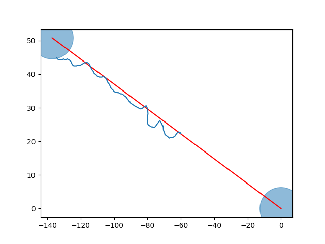

# Monkey D Diboat
## Robot bateau suiveur de cap

Par Camilo ORTIZ et Tristan LE FLOCH, étudiants en Robotique Mobile à l'ENSTA Bretagne, promo 2024.

DDBoat n°2

## A propos

Le fichier python `main.py` regroupe l'ensemble de nos travaux lors de cette semaine à Guerlédan avec différente fonctions dont celles de régulation des moteurs, de suivi de cap, de suivi de ligne, etc

Nous avons défini une classe `bateau` qu'il faut instancier afin de pouvoir utiliser les fonctions de celle ci. 
Une fois ceci effectué, il y a deux fonctions principales sur lesquelles nous avons travaillé. La première est follow_one_cap() qui prend en entrée un cap en degrés et une durée en secondes. Cette fonction fait suivre un cap au bateau pendant une certaine durée. 
L'autre fonction majeure est follow_line(), elle permet au bateau de suivre une ligne définie par un point de départ et un point d'arrivée.

le fichier `compute_vector_field.py` permet de calculer le champ de vecteur associé au suivi de ligne afin de déterminer les coefficients associés.

Le fichier `stop.py` sert simplement à arrêter les moteurs du robot.

Le fichier `read_temperature.py` sert à rapidement vérifier la température des moteurs.

Tous les autres fichiers python sont des drivers ou des programmes de test relatifs à ceux-ci. Pour en savoir plus sur les drivers, se référer à `README_drivers.md`.

## Log et résultat

Nous avons malencontreusement oublié d'enregistrer nos logs lors de la réussite du suivi de ligne pour l'évaluation du vendredi 24/02/2023 à 10h30, mais nous avons tout de même pu récupérer nos points GPS affichés dans le terminal lors de la mission ce qui nous a permis de récupérer une bonne partie des logs de la mission (pas le début malheureusement).

Voici le résultat:

Cela nous semble satisfaisant car le robot suit bien la ligne, malgré un fort courant, surtout vers la fin bien que l'on puisse observer quelques oscillations.

test
